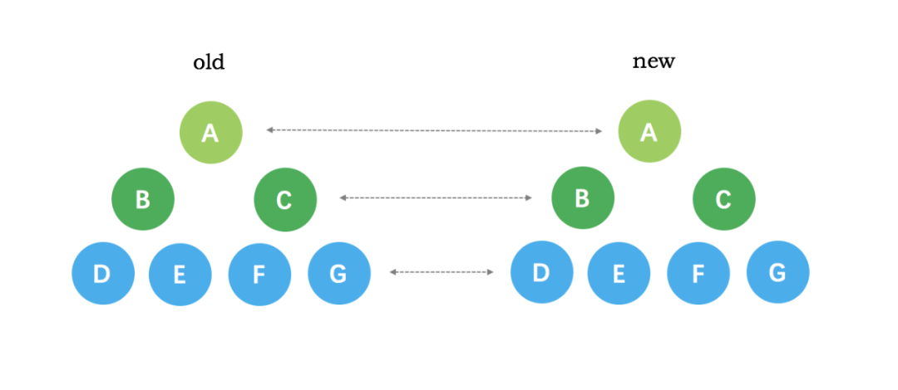
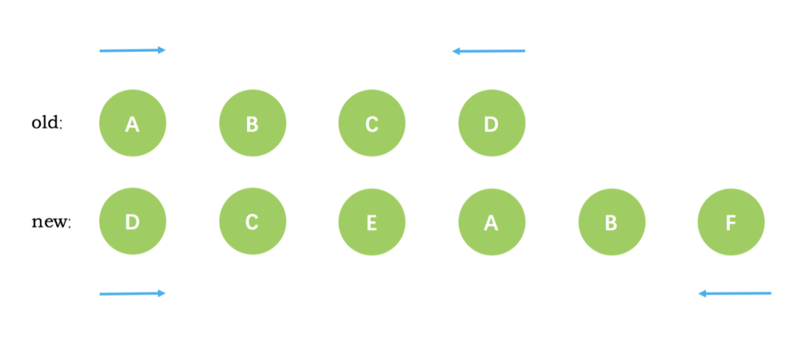

# 前言 

在写vue中diff算法的核心逻辑之前，我想先写一点Vue,React 这些框架流行起来的原因。

大家的第一想法都是这些框架提升了开发效率，这种说法是没有问题的，但可能会造成一种错觉就是这些框架提高了页面操作DOM的性能，这种错觉的产生就和对Diff算法简洁和高效的铺天盖地的赞美有关系。

MVVM框架真的提高了页面操作DOM的性能吗？这个问题可能只有7成对，另外3成就要看情况了。首先，无论框架多么优秀，浏览器还是只认识“三剑客”，这些框架总归是对三剑客使用方式的封装，想要动态添加一个DIV，还是少不了 `document.createElement('div')` 这句话，所以，框架并没有提升一丝丝对DOM操作的性能，严格来说，因为增加了这一封装，性能还是受了影响的。
 

但大家为什么还是如此追捧这些框架呢？因为从一个项目开发的整体效果来看，**框架提高了开发效率，提升了性能操作的下限**，在Web应用越来越复杂的今天，团队中的能力总是有参差的，框架保证了每个人的产出有个可以接受的下限。另外，框架都是基于组件模式的思想，这一点也更利于大型项目的开发。

关于框架 和 直接操作DOM的性能之争，这里有[尤大的一篇经典回答](https://www.zhihu.com/question/31809713/answer/53544875)

# diff 的作用 及其 在整个vue逻辑中所处的位置

## 作用
在框架对性能的综合提升中，Diff 算法功不可没。

在框架对DOM的操作过程中，秉承的一个思想是**尽可能的减少操作dom的数量和次数**。在如何减少操作次数方面，VUE和React都设置了`Virtual Dom`, 通过收集一系列数据变动更新`Virtual Dom` ，然后统一映射成为真实的Dom。

Diff 算法的主要作用在于减少了所需操作的DOM数量。

## 位置

在 VUE 的整个逻辑中，组件在`render`阶段会被`Watcher`收集所有的依赖到`Dep`开始监听，当页面操作中更新了被监听的值会触发对应的`setter`，进而执行`updataComponent()`，该方法内部执行的过程就是`patch`的过程.

当进行patch的时候，会利用diff算法对新老VNode进行比对，找到同级别所有可复用的节点，这样在映射为真实DOM的时候，就减少了需要操作的DOM数量。


## 结果

diff 算法的最终的结果是生成了一个新的 `Virtual Dom`，这个虚拟DOM已经尽可能的复用了老虚拟DOM的VNode。因为一个VNode 就对应一个真实的DOM，所以，diff算法实现了复用DOM节点的目的。

# diff 算法 

## 算法思想和流程

跨出 VUE 和 React 去考虑一个树的diff算法，应该是将树a中的节点和树b中的每一个节点都进行比较，找出相同和不同的点，这个过程就需要`O(n^2)`的时间复杂度。如果在加上对比过程中发现旧节点在新的树中未找到，那么就需要把旧节点删除，删除一棵树的一个节点(找到一个合适的节点放到被删除的位置)的时间复杂度为O(n),同理添加新节点的复杂度也是O(n),合起来diff两个树的复杂度就是O(n³)。

但现在的MVVM 框架对diff算法进行了优化，只用于对树结构的同级进行比较， 而不是对树结构进行逐层遍历搜索，所以时间复杂度只有`O(n)`。 

除此之外，Vue的diff算法还有一个比较明显的特征是，从两端开始进行比较, 在比较的过程中,逐渐向中间进行收拢。

借鉴一下网图，形象的说明：





## 算法的具体实现

diff 算法的具体实现位于`src\core\vdom\patch.js`中的`updateChildren()`方法内，具体源码可以看[这里](./patch.js)

因为是两端比较，所以首先标记新旧`VNode树` 的起始节点和结束节点。

```javascript
// 新旧节点树的下标
let oldStartIdx = 0
let newStartIdx = 0
let oldEndIdx = oldCh.length - 1
let newEndIdx = newCh.length - 1

// 新旧节点树的起、止节点
let oldStartVnode = oldCh[0]
let oldEndVnode = oldCh[oldEndIdx]
let newStartVnode = newCh[0]
let newEndVnode = newCh[newEndIdx]
```

做过标记之后，可以开始比较了。比较是放在 `while` 循环中进行的，只要两个树的起始节点都小于或等于截止节点，那么循环就会一直进行，只到其中一个树先遍历完才会退出。在循环的过程中，会对各种可能的情况进行比较, 在不同的情况下，会对DOM进行不同的处理，这些处理总结下来，有这么几种：

- 更新了节点
- 删除了节点
- 增加了节点
- 移动了节点


首尾互相比较，有四种相等的可能性，如果都不相等，就放在 else 中处理。

```javascript
while(oldStartIdx <= oldEndIdx && newStartIdx <= newEndIdx) {
  if (sameVnode(oldStartVnode, newStartVnode)) {
    // 首首相等，对DOM不做处理
    patchVnode(oldStartVnode, newStartVnode)  // patchVnode 对相等的节点是不做处理的
    oldStartVnode = oldCh[++oldStartIdx]  // 老节点树的start右移一位
    newStartVnode = newCh[++newStartIdx] // 新节点树的start右移一位

  } else if (sameVnode(oldEndVnode, newEndVnode)) {
    // 尾尾相等，对DOM不做处理
    patchVnode(oldEndVnode, newEndVnode)
    oldEndVnode = oldCh[--oldEndIdx]  // 老节点树的end左移一位
    newEndVnode = newCh[--newEndIdx]  // 新节点数的end左移一位

  } else if (sameVnode(oldStartVnode, newEndVnode)) {
    // 首尾相等，对DOM进行移动操作
    patchVnode(oldStartVnode, newEndVnode)
    // nodeOps 是对insertBefore和nextSibling等原生操作的封装
    // 这一步是对真实的DOM节点进行的操作，因为老节点树的Node.elm指代着真实的DOM
    // 
    // 因为比较的结果是首尾相等，说明 旧节点树的 start 在 新节点树的end位置，所以做一个移动操作
    // 将oldStartVnode.elm 移动到 oldEndVnode.elm 的后面，也即将真实DOM移动到了正确的位置。
    canMove && nodeOps.insertBefore(parentElm, oldStartVnode.elm, nodeOps.nextSibling(oldEndVnode.elm))    
    oldStartVnode = oldCh[++oldStartIdx]  // 老节点树的start右移一位
    newEndVnode = newCh[--newEndIdx]  // 新节点数的end左移一位

  } else if (sameVnode(oldEndVnode, newStartVnode)) {
    // 尾首相等，对DOM进行移动操作
    // 道理和 首尾相等的道理一致
    patchVnode(oldEndVnode, newStartVnode, insertedVnodeQueue, newCh, newStartIdx)
    canMove && nodeOps.insertBefore(parentElm, oldEndVnode.elm, oldStartVnode.elm)
    oldEndVnode = oldCh[--oldEndIdx]
    newStartVnode = newCh[++newStartIdx]
  } else {
    // 均不相等的情况下
    // 找到新节点树的起始节点 newStartVnode 在老的节点树中是否已存在
    // 如果存在，使用 idxInOld 记录
    if (isUndef(oldKeyToIdx)) oldKeyToIdx = createKeyToOldIdx(oldCh, oldStartIdx, oldEndIdx)
    idxInOld = isDef(newStartVnode.key)
      ? oldKeyToIdx[newStartVnode.key]
      : findIdxInOld(newStartVnode, oldCh, oldStartIdx, oldEndIdx)
      
    // 判断idxInOld是否存在，如果不存在，新建newStartVnode对应的DOM
    if (isUndef(idxInOld)) { // New element
      createElm(newStartVnode, insertedVnodeQueue, parentElm, oldStartVnode.elm, false, newCh, newStartIdx)
    } else {
      // 如果新节点树的VNode在旧节点树中存在， 使用 vnodeToMove 存储旧节点树中对应的节点
      vnodeToMove = oldCh[idxInOld]
      if (sameVnode(vnodeToMove, newStartVnode)) {   
        patchVnode(vnodeToMove, newStartVnode, insertedVnodeQueue, newCh, newStartIdx)
        oldCh[idxInOld] = undefined
        // 将vnodeToMove的DOM移动到旧节点树的最前方，实际上也对应newStartVNode的DOM在新节点树中的位置
        canMove && nodeOps.insertBefore(parentElm, vnodeToMove.elm, oldStartVnode.elm)
      } else {
        // 如果 vnodeToMove 存在但是和 newStartVnode 不相等，则和idxInOld不存在的处理方式相等
        createElm(newStartVnode, insertedVnodeQueue, parentElm, oldStartVnode.elm, false, newCh, newStartIdx)
      }
    }
  }
}


```


无论新旧节点树哪一个先遍历完成，循环都会退出，那么这个时候，如果剩下的一棵树还有未遍历的节点，那么就又分了两种情况，如果新节点树有剩余，那么剩余的节点全部直接增加，如果旧节点树有剩余，那么这些剩余的节点全部直接删除。

```javascript
if (oldStartIdx > oldEndIdx) {
  refElm = isUndef(newCh[newEndIdx + 1]) ? null : newCh[newEndIdx + 1].elm
  addVnodes(parentElm, refElm, newCh, newStartIdx, newEndIdx, insertedVnodeQueue)
} else if (newStartIdx > newEndIdx) {
  removeVnodes(oldCh, oldStartIdx, oldEndIdx)
}

```

上面三段代码是方法`updateChildren`的内容，也是diff算法的核心逻辑。

 

