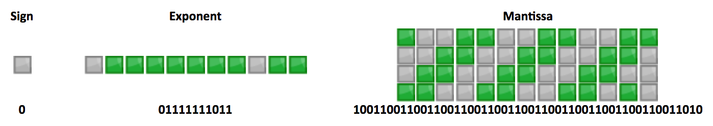

[JavaScript 浮点数陷阱及解法](https://github.com/camsong/blog/issues/9)

在JS中，$0.1 + 0.2 !== 0.3$ 的原因，说起来就一句话： **浮点数误差**, 所以本文主要是说明一下什么是浮点数误差。

在强类型语言中，关于数字会分为`Int, Float, Double`等类型，但在JS中，所有的数字都只有一种类型：`Number`, 对应着强类型语言中的`double`类型。

# JS中的数字存储

JS并没有为**整数**给出一种特定的类型，所有的数字类型均为 8 个字节 64 位固定长度表示的**双精度浮点类型**,其取值范围从 $-(2^{63} -1)$ 到 $2^{63} -1$。


JS中的每一个数字都是用64位比特表示的，这64位比特可分为三部分：
- 符号位S： 第1 位是正负数符号位（sign），0代表正数，1代表负数
- 指数位E：中间的 11 位存储指数（exponent），用来表示次方数。
- 尾数位M：最后的 52 位是尾数（mantissa），超出的部分自动进一舍零。

所以，所有的数字都可以用下面这个公式表示
$$
(-1)^S * 2^E * M
$$

这个公式在表示double类型数字的时候还有一些具体的情况考虑。

对于**指数位E**， 因为次方数可以为正，也可以为负，所以这里规定指数值全都减去$2^{11}$ 的中间数1023，将[0, 2047]均分为正负两部分。

对于**尾数位M**，将一个数用科学计数法表示的时候，这个数包括整数部分和小数部分，但这52位比特位没有再进行区分，数字存进去之后还怎么区分整数部分和小数部分？ 但在二进制中，正好可以规避这个问题，因为M的整数部分只可能是1，所以在实际存储的时候，这个整数部分的1将不再内存中进行存储，内存中只保留后面的小数部分。但我们再读取内存位数还原数字的时候，再逻辑上把这个整数部分的1给加上。

那么相应的，在二进制的世界中，对于每一位数字，都可以采用下面这个公式表示：
$$
(-1)^S * 2^{E-1023} * ( M + 1 )
$$

`S, E, M `分别对应上述的存储区的值。


# 0.1 在内存中的存储

以0.1为例，对上述公式实际演示一遍。

先复习一下，小数点之后的小数位的十进制转二进制：**乘2取整，正序排列**。所以，除非小数乘以2取整之后最后为0，这个小数可以被精确表示，其他的小数位都是可以用无穷的位数表示的，位数越多，表示的也就越精确。

> 当小数满足这个公式的时候，可以被精确表示：$\frac{m}{2^n}$, n和m都是正整数。 比如，1/2、3/4、7/8、3/16等等。


0.1 用二进制表示可以是：`0.0001100 1100 1100 1100...` 1100 可以无限循环下去，放到内存中存储其表现就是这样：




用科学计数法表示就是：
$$
1.100 1100 1100 * 2^{-4}
$$

用公式表示就是
$$
(-1)^0 * 2^{ 1019 - 1023 } * (1 + 2^{-1} + 2^{-4} + 2^{-5} + 2^{-8} + 2^{-9} + ... + 2^{-49} + 2^{-52}  ) 
$$

如此这样，计算出来的最终结果就是：`0.10000000000000000555`。

那么，`0.1 + 0.2 `在计算机中是这样计算的：

```javascript
 // 0.1 和 0.2 都转化成二进制后再进行运算
  0.00011001100110011001100110011001100110011001100110011010
+ 0.0011001100110011001100110011001100110011001100110011010
= 0.0100110011001100110011001100110011001100110011001100111

// 将计算结果再次转为10进制就得到 0.30000000000000004
// 也即：0.1 + 0.2 = 0.30000000000000004
```

这里还有一点需要注意，当JS从内存中读取一个数时，最多保留**17**位有效数字。所以上述计算结果是小数点后17位。

# JS中的最大安全**整数**

什么是安全整数？ 

在JS中，所有的数都是双精度浮点数，整数也只是表现得像个“整数”的浮点数，在某些情况下，当我们需要一个整数的时候，可能会有多种存储形式表示这个整数，那么这里的安全整数，其含义就是在哪个范围内，一个整数只对应一种浮点数的存储形式。

根据上文讲到的存储说明，M 部分只有52位，这52位全部用来存储科学计数法中的小数部分（因为整数部分默认是1），所以M部分的最大值： `111111....111`（小数点后一共52个1）, 那么加上整数部分的1，将`1. 111111....111`转为整数，那么指数部分的值应该是`52`,所以最大值应该是：
$$
2^{53} - 1 = (-1)^0 * 2^{52} * (1 + 2^{-1} + 2^{-2} + ... + 2^{-52})
$$

那么相应的最小值就是：$-2^{53} + 1$

在JS中，这两个值分别存储在 ` Number.MAX_SAFE_INTEGER`  和 ` Number.MIN_SAFE_INTEGER` 中


# JS中解决浮点数误差

在数据计算的时候，不能只能最后的结果进行精度处理，因为在计算过程中的精度差值有可能使结果产生极大的区别。

一个取巧的方式是将所有的小数都转为整数之后再进行计算。加减乘数四则运算都可以通过这种方式实现精确计算。


当然，还有上述文章的作者推荐的NPM包：[number-precision](https://github.com/nefe/number-precision),包含简单的四则运算，封装的API使用起来也很方便，简单拷贝一下用法：

```javascript
npm install number-precision --save

NP.strip(num)         // strip a number to nearest right number
NP.plus(num1, num2, num3, ...)   // addition, num + num2 + num3, two numbers is required at least.
NP.minus(num1, num2, num3, ...)  // subtraction, num1 - num2 - num3
NP.times(num1, num2, num3, ...)  // multiplication, num1 * num2 * num3
NP.divide(num1, num2, num3, ...) // division, num1 / num2 / num3
NP.round(num, ratio)  // round a number based on ratio


Usage:

import NP from 'number-precision'

NP.strip(0.09999999999999998); // = 0.1
NP.plus(0.1, 0.2);             // = 0.3, not 0.30000000000000004
NP.plus(2.3, 2.4);             // = 4.7, not 4.699999999999999
NP.minus(1.0, 0.9);            // = 0.1, not 0.09999999999999998
NP.times(3, 0.3);              // = 0.9, not 0.8999999999999999
NP.times(0.362, 100);          // = 36.2, not 36.199999999999996
NP.divide(1.21, 1.1);          // = 1.1, not 1.0999999999999999
NP.round(0.105, 2);            // = 0.11, not 0.1

```


#### `Number`对象中几个常量的值

```javascript

Number.MAX_VALUE = Math.pow( 2, 1024 ) - 1

Number.MIN_VALUE = Math.pow( 2, -1027 )  // 不知为啥,存疑

Number.MAX_SAFE_INTEGER = Math.pow( 2, 53 ) - 1

Number.MAX_SAFE_INTEGER = -( Math.pow( 2, 53 ) - 1 )

```


