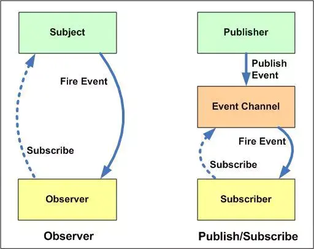
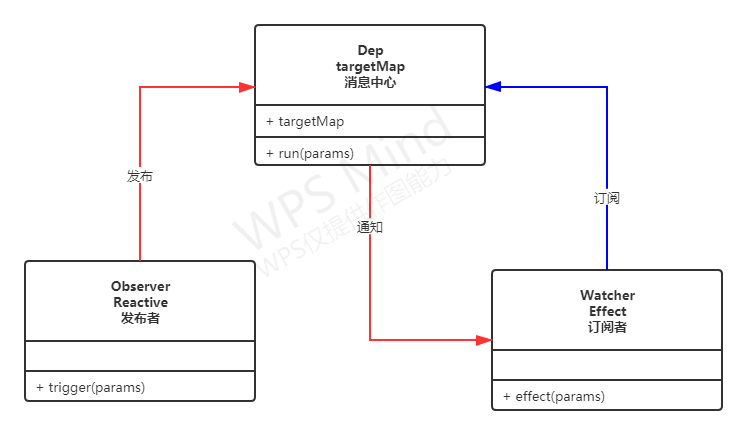

# 大纲
1. Object.defineProperty()基础知识讲解，重点是描述符的分类
2. Proxy的基础知识和Vue中用到的几个捕捉器
3. 发布订阅模式讲解以及在Vue中的映射
4. Vue3中发布订阅模式的具体使用 


## Object.defineProperty()

JS世界中的每个对象属性都有**属性描述符**，用来对该属性进行精细操作。`Object.getOwnPropertyDescriptor(obj, key)`方法可以用来获取指定属性的描述符。如果想要对一个属性的描述符进行新增和修改，可以通过[Object.defineProperty()](https://developer.mozilla.org/zh-CN/docs/Web/JavaScript/Reference/Global_Objects/Object/defineProperty)。

属性描述符一共有6种：`configurable`, `enumerable`, `value`, `writable`, `get`, `set`。

1. configurable: 布尔值，默认false，表示该属性的描述符（除了value 和 writable）是否允许被修改，也用于表示该属性是否能够被删除。当值是 false 的时候，对不允许修改的描述符做的任何修改都会抛出一个错误：`Uncaught TypeError: Cannot redefine property`；当想要通过`delete`或`Reflect.deleteProperty`删除该属性的时候会返回一个`false`，表示删除失败。

2. enumerable: 布尔值，默认false，表示该属性是否允许被遍历。主要用于 `for...in` 和 `Object.keys()`中

3. value: 该属性对应的值

4. writable: 布尔值，默认false，表示 value 是否可写。在非严格模式下，对writable=false的属性进行赋值，不会报错，但同样的赋值也不会生效。

5. get: 属性的getter函数

6. set: 属性的setter函数

对于属性的描述符默认值，这里有一个总结：
- 拥有布尔值的键 configurable、enumerable 和 writable 的默认值都是 false。
- 属性值和函数的键 value、get 和 set 字段的默认值为 undefined。

属性描述符分为两种：**数据描述符** 和 **存取描述符**

value 和 writable 属于 数据描述符

get 和 set 属于存取描述符

configurable 和 enumerable 则即可以属于存取描述符也可以属于数据描述符。在一个描述符对象中，这两者具体属于哪一种要根据其他描述符来确定。

对于一个描述符对象`descriptor`而言，他不能同时具备 纯数据描述符 和 纯存取描述符，如果这两种描述符同时出现，系统会产生一个异常。
 

## Proxy 和 Reflect

[Proxy](https://developer.mozilla.org/zh-CN/docs/Web/JavaScript/Reference/Global_Objects/Reflect/defineProperty) 和 [Reflect](https://developer.mozilla.org/zh-CN/docs/Web/JavaScript/Reference/Global_Objects/Reflect) 是ES6为我们提供的**元编程**方式，这两个对象允许我们拦截并定义基本语言操作的自定义行为，比如，属性查找，赋值，枚举，函数调用等等。

想对于`Object.defineProperty`, Proxy对象拦截更加方便和全面。生成一个代理有统一简单的方式：
```javascript
const proxy = new Proxy(target, handler)
```
`handler`是一个对象，这个对象的属性是固定的，代表了Proxy可以拦截的操作有哪些，随着语言层面的发展和规范，这些属性也有部分增删，现在在MDN上还保留的有13个：

1. handler.getPrototypeOf()： Object.getPrototypeOf 方法的捕捉器。
2. handler.setPrototypeOf():  Object.setPrototypeOf 方法的捕捉器。
3. handler.isExtensible():  Object.isExtensible 方法的捕捉器。
4. handler.preventExtensions():  Object.preventExtensions 方法的捕捉器。
5. handler.getOwnPropertyDescriptor(): Object.getOwnPropertyDescriptor 方法的捕捉器。
6. handler.defineProperty(): Object.defineProperty 方法的捕捉器。
7. handler.has(): in 操作符的捕捉器。
8. handler.get(): 属性读取操作的捕捉器。
9. handler.set(): 属性设置操作的捕捉器。
10. handler.deleteProperty(): delete 操作符的捕捉器。
11. handler.ownKeys(): Object.getOwnPropertyNames 方法和 Object.getOwnPropertySymbols 方法的捕捉器。
12. handler.apply(): 函数调用操作的捕捉器。
13. handler.construct(): new 操作符的捕捉器。 

这些在代理属性中，在Vue3中使用的有这些：`get`,`set`,`deleteProperty`,`has`,`ownKeys`

这些代理器的使用可以参考[源码](https://github.com/vuejs/vue-next/blob/master/packages/reactivity/src/collectionHandlers.ts)


## 发布订阅模式

很多地方将vue建立双向绑定是使用的观察者模式，这种说话是有点问题的。观察者模式和发布订阅模式虽然基本原理相同，订阅者在事先发布一个订阅通知，然后再得到事件的通知的时候执行自己想要执行的逻辑，但二者有一个不同点是，观察者模式将收集到的订阅全部存储在自身，发布订阅模式则是借助了一个消息中心，这样更加解耦。



结合Vue3中使用的术语，发布订阅模式是这样的：




1. 每个订阅者都有一个`effect()`方法，该方法用来接收消息中心的通知。当**某一个时刻**到来，系统会将该订阅者收集到消息中心的`targetMap`；
2. 当**某一个动作**被触发，发布者会执行发布操作`trigger`，通知消息中心将消息通知到订阅者；
3. 消息中心接收到发布者的消息，通过`run`方法，从`targetMap`中找到符合要求的订阅者，执行订阅者的`effect`方法。

在Vue3中，通过Proxy代理组件中的数据生成Reactive，**某一个时刻**即是组件中读取Reactive中的属性时，**某一个动作**即指组件中对某一个Reactive中的属性进行赋值。


## Vue3 中的发布订阅模式代码

根据上述基本知识，对Vue3的响应式原理部分的代码做个简化，以方便理解。[demo在这里](./test2.js)

```javascript
let targetMap = new WeakMap()
const activeReactiveEffectStack = []
/**
 * 依赖收集阶段，订阅者执行订阅的方法，信息将被存储在消息中心
 */
function track(target, key) {
  const effect = activeReactiveEffectStack[activeReactiveEffectStack.length - 1]

  if (effect) {
    let depsMap = targetMap.get(target) 
    if (!depsMap) {
      targetMap.set( target, depsMap = new Map() )
    }
    let dep = depsMap.get(key)
    if (dep === void 0) {
      depsMap.set(key, (dep = new Set()))
    }

    if (!dep.has(effect)) {
      dep.add(effect)
    } 
  } 
} 

```
上述代码可以看到，消息中心的数据结构是一个`weakMap`, weakMap的键名target可以理解为每个组件中定义的数据`data`和计算数据`computed`,  key 表示对象中具体的属性。

而key最终将要存储的值是存储在`activeReactiveEffectStack`列表中的最后一个元素`effect`, `effect`是一个方法，其简化代码如下：
```javascript
const effect = function reactiveEffect(...args) {
  // effect 是每个订阅者的update方法
  activeReactiveEffectStack.push(effect) 
  fn(...args)
  activeReactiveEffectStack.pop()
}

```
作用是在每次执行订阅者的自定义方法之前，将其自身存储在`activeReactiveEffectStack`这个栈中，当自定义方法执行完毕，再从栈中取出。每当相对已监听的对象进行赋值时，都会执行这个操作。 

这段代码是对上节的**某一个时刻**进行的补充，也即是，当系统读取Reactive中的属性时，如果这个这个属性并不存在自定义代码，那么消息中心将不在对其进行收集。  


[vue2的发布订阅模式以及对应代码](https://juejin.im/post/6844903986298896398#heading-3)

首先了解下vue3.0中响应式的用法：reactive包装数据，effect定义数据变化后的回调。


