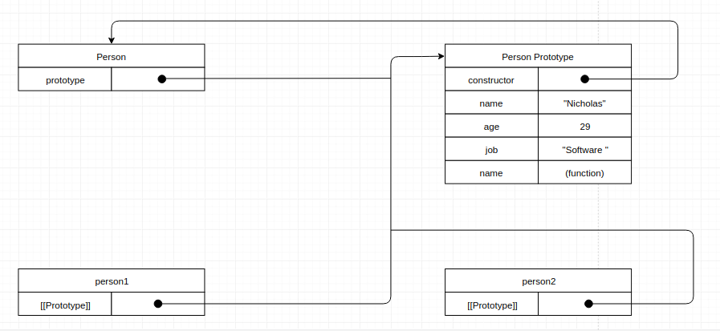
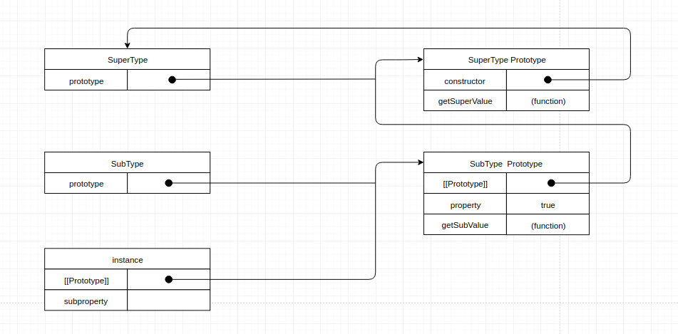

原型链是JS中一个极其重要的概念，对于理解JS中的继承，`new` 关键字，`Class`，组件和插件的编写，都有很重要的意义。

# 原型对象

要理解原型链，首先对**原型对象**有一个认识。正如该名词字面上表示的，这是一个对象，但这个对象不需要开发人员显示的声明创建，当我创建一个函数的时候，这个函数自动就拥有了一个原型对象。

## 几个基本概念和关系
为了方便理解，先统一列出几个概念

- 函数
- 函数的prototype属性
- 原型对象
- 原型对象的constrator属性（指向构造函数的指针）
- 实例对象
- 实例对象的内部属性[[Prototype]]

理清楚了这几个概念之间的关系，也就理解了原型对象，一图胜千言，上个图先：



上图中共有一个构造函数`Person`, 两个实例`person1`、 `person2`, 一个原型对象`Person Prototype`。 这是JS中对这三个实体的一个基础设计，至于为什么要这样设计，我们在后面将会看到。

当我们创建一个构造函数`Person`时，JS会为该构造函数创造一个属性`prototype`， 这个属性的值本质上是一个指针，指向构造函数对应的**原型对象**

当调用构造函数`Person`创造一个新的实例`person1`之后，该实例的内部将生成一个属性`[[Prototype]]`, 该属性的值是一个指针，指向构造函数Person对应的**原型对象**

当JS创造一个原型对象以后，所有的原型对象都自动获得一个属性`constructor`。这个属性的值也是一个指针，指向对应的构造函数。 在这里，原型对象没有一个显式的名称，当我们想要表示`Person`所对应的原型对象，我们就用`Person Prototype`来表示。当然，在具体使用的时候，你可以将原型对象显式的赋予一个变量。

> 只有函数对象才具有`prototype`属性
> 
> [[Prototype]]属性在浏览器中有被实现，其名称是`__proto__`， 而在其他实现中，这个属性是不可见的。

从上图我们可以看到，当实例`person1` 和 `person2`被创建之后，这两个实例其实和构造函数是没有直接联系的，它们只和构造函数的原型对象有关系。这也是多个实例可以共享原型对象中的属性和方法的基础。

当我们试图访问一个实例中的属性时，代码会执行一次搜索，搜索的关键字就是试图访问的属性的名称。搜索首先从实例对象本身开始，如果找到了则直接返回，不再继续搜索；如果没有找到，则继续搜索实例对象的属性`[[Prototype]]`所指向的值，也就是原型对象，如果在原型对象中找到了目标属性，就返回对应的值。


# 原型链


### 什么是原型链
实现原型链的基本思想是更改构造函数的原型对象指向其父级的一个实例，也就是说其本质是重写了原型对象。

再次总结一下`构造函数`,`原型`,`实例`三者的关系：
- 每个构造函数都有一个原型对象
- 原型对象都包含一个指向构造函数的指针
- 实例都包含一个指向原型对象的内部指针

同样上个图说明一下：


在这个例子中，我们创建了两个构造函数，两个实例，通过重写子类的原型对象，构建了一条原型链

```javascript
// 定义两个构造函数
function SuperType () {
  this.name = 'super'
  this.superValue = true
}
function SubType() {
  this.name = 'sub'
  this.superValue = false
}

// 在SuperType的原生的原型对象上添加方法
SuperType.prototype.getSuperValue = function() {
  console.log(this.superValue)
}
// 在SubType的原生的原型对象上添加方法
SubType.prototype.getSubValue = function() {
  console.log(this.superValue)
}

const superInstance = new SuperType()

// 将SubType的原生对象重写为SuperType的实例
SubType.prototype = superInstance

// 在SubType新的原型对象上添加一个方法
SubType.prototype.getName = function() {
  console.log(this.name)
}
const subInstance = new SubType()

superInstance.getSuperValue() // true
superInstance.getName() // super

subInstance.getSuperValue() // false
subInstance.getName() // sub

subInstance.getSubValue() // subInstance.getSubValue is not a function

```

上述代码中，subInstance之所以可以调用getSuperValue, 原因就是通过原型链扩展了上节提到的原型搜索机制，这一过程经历了三个步骤：

1. 搜索subInstance，在该实例对象中没有找到，则通过该对象的`[[prototype]]`属性确定其原型对象为`SubType.prototype`；
2. 搜索SubType.prototype,也即是搜索 superInstance, 同样没有找到，同样通过该对象的`[[prototype]]`属性确定其原型对象为`SuperType.prototype`；
3. 搜索 SuperType.prototype，找到指定方法，并停止搜索。

这就是JS中实现原型链的基本方法，通过一个实例对象的`[[prototype]]`属性永远指向他的原型对象，实现链条查询。

在一个原型链最底层的构造函数，通过它生成一个实例，那么该实例实际上也是其链条上游所有原型对象的实例。以上述代码为例：

```javascript
subInstance instanceof SubType // true
subInstance instanceof SuperType // true
subInstance instanceof Object // true
```

### 原型链的几个问题

原型链的构造使JS语言变得更加灵活，但没有一种设计是十全十美的，在使用原型链的时候也有一些需要注意的点

##### 如何覆盖超类型中的方法

当我们想要覆盖一个超类型中已经存在的方法时，可以在子类型的原型对象中添加一个同名方法，但什么时候添加需要注意一下。

正如上述代码块中显示的那样，如果想在`subInstance`的原型对象中添加一个`getSuperValue`方法，并使其返回false, 我们需要在其原型对象被替换之后，在新的原型对象上进行添加：

```javascript

SubType.prototype = superInstance

SubType.prototype.getSuperValue = function() {
  return false
}

```
如此设计，我们相当于是在 SuperType 的一个实例上添加了一个 `getSuperValue` 方法，这个方法可以供所有的`SubType`的实例`subInstance`使用，但不会影响 `SuperType`其他的实例。这也是很明显的，因为SuperType的原型对象始终不曾被做过任何修改嘛。

##### 原型链上的属性被所有实例共享。

正如上面例子一直演示的那样，原型对象中所有的方法都可以被它的实例所调用，那么同样的，原型对象中所有属性表示的值也是被所有的实例共享的。

这一点在实例编程中其实是很危险的，因为有可能在任何地方做的任何一个小修改，都会影响到全局，我们应该极力避免这种情况。

怎么避免呢，也很简单，在设计的时候区分好这些属性是私有的，还是共享的，不在原型对象中只存放共享的属性，将所有的私有属性都放进构造函数中，保证这些属性只属于一个实例。 


