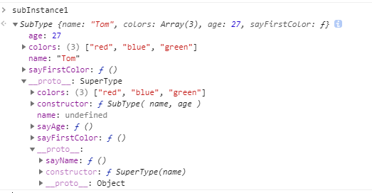
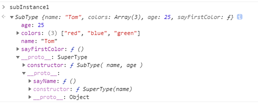

在很多经典的面向对象编程语言中，都支持两种继承方式：接口继承和实现继承。而在JS中，因为函数没有签名，并没有办法实现接口继承（TS替我们做到了这一点），只能支持一种继承方式：`实现继承`的主要工作原理，正是基于上篇文章讲到的[原型链](../原型链/index.md)

在《Javascript高级程序设计》一书中，将继承的实现模式分为6种，即：

0. 原型链继承（参考原型链文章）
1. 经典继承
2. 组合继承
3. 原型式继承
4. 寄生式继承
5. 寄生组合式继承

这几种分类，1和2是一种风格，逐步递进；3和4是另一种风格，最终，将2 和4进行结合得出5，也就是实际编程中使用的`继承`方式。

我一向不太喜欢搞这么多花里胡哨的名词和概念，名词起的太多，会干扰对其本质的探索，对知识点的掌握流于表面。也就是在面试官那里或一些不靠谱的小leader嘴里，这些名词的作用才凸显出来。

# 利用构造函数实现继承 —— 经典继承和组合继承

继承的目的也就是在子类中能够使用父类中的属性和方法，通过构造函数可以很方便的实现这一点。

我们定义两个构造函数，`SuperType()`  和 `SubType()`, 通过在子构造函数中调用父构造函数，可以将父类中所有的属性和方法绑定到子类的实例中，**这也就是经典继承的实现方法**

但同时，我们也知道，对于父类中属性和方法，有部分是私有的，但还有一些其实是可以共享的，可以公用的，我们可以借助原型链的工作原理，让子类和父类共享部分属性和方法，**这就是组合继承的做法**

```javascript

function SuperType(name) {
  this.name = name
  this.colors = ['red', 'blue', 'green']
  this.sayFirstColor = function() {
    console.log(this.colors[0])
  }
}

SuperType.prototype.sayName = function() {
  console.log(this.name)
}

function SubType( name, age ) {
  // 继承父类中的属性
  SuperType.call(this, name)

  this.age = age
}

// 继承方法
const superInstance = new SuperType()
SubType.prototype = superInstance
SubType.prototype.constructor = SubType

SubType.prototype.sayAge = function() {
  console.log(this.age)
}

// 验证
const subInstance1 = new SubType('Tom', 27)
subInstance1.colors.push('black')
console.log(subInstance1.colors)  //  ["red", "blue", "green", "black"]
subInstance1.sayName() // Tom
subInstance1.sayAge() // 27

const subInstance2 = new SubType('翠花', 18) 
console.log(subInstance2.colors) // ["red", "blue", "green"]
subInstance2.sayName() // 翠花
subInstance2.sayAge() // 18

```

继承这个概念是在了解了原型链之后才进行学习的，所以很自然的我们会直接实现这种所谓的组合继承。
将属性在实例中进行私有化，将方法保留在父级的原型对象中，通过重定义子类的原型对象实现方法共享。


在控制台中进行查看, 可以看到子类的实例中拥有了父类的属性`colors`, `name`, `sayName`方法则还是存在与父级，子类通过原型链进行查找调用。

# 创建实现继承的方法 —— 原型式继承 和 寄生式继承

这种实现继承的方式对被继承的对象或者说父类的范围进行了扩展，只要你有一个已经存在的对象（不要求这个这个对象一定是由构造函数创建的），将其传入封装好的方法内，在方法内部进行处理之后返回一个新的对象，这个处理后的新对象就实现了对这个传入对象的继承。

那么这个封装的方法做了什么呢？其本质还是对原型链的应用。

在封装的方法内，声明一个构造函数，修改该构造函数的原型对象为传入的对象，然后返回该函数的实例，这就是**原型式继承**

对函数的实例不直接进行返回，而是根据需求对该实例进行扩展之后再返回，这就是**寄生式继承**

```javascript
// 原型式继承
function object(original) {
  function F() {}
  F.prototype = original
  return new F()
} 

// 寄生式继承
function parasitic(original) {
  const clone = object(original)
  clone.sayName = function() {
    console.log(this.name)
  }
  return clone
}

// 验证
const superInstance = {
  name: 'Tom',
  colors: ["red", "blue", "green"]
}
const subInstance1 = parasitic(superInstance)
const subInstance2 = parasitic(superInstance)

subInstance1.colors.push('black')

console.log(subInstance1.colors) // ["red", "blue", "green", "black"]
console.log(subInstance2.colors) // ["red", "blue", "green", "black"]

subInstance1.sayName() // Tom
subInstance2.name = '翠花'
subInstance2.sayName() // 翠花

subInstance1.colors === subInstance2.colors // true
subInstance1.sayName === subInstance2.sayName // false

```
查看`object()`方法可以看出来，将新的构造函数`F`的原型指向传入的对象，并返回其实例，这其实和原型链继承是同样的做法。通过该方法得到的所有实例，都共享`superInstance`对象。

# 寄生组合式继承

这是一种结合上述各种方式优点的做法。

在组合继承中，有一点不好的就是需要调用两次父构造函数，一次是更改子类型实例的原型,这使得子类实例可以使用父类的方法
```javascript
const superInstance = new SuperType()
SubType.prototype = superInstance
```
一次是在子类型的构造函数函数中，这使得子类实例中拥有了父类的属性和方法
```javascript
function SubType( name, age ) {
  // 继承父类中的属性
  SuperType.call(this, name)
  // ...
}
```


查看组合继承实例的结构图，我们发现子类实例的属性和方法在它的原型链上游也有一份一模一样的，这其实不是很必要的，因为我们只对最终的子类进行了实例化，所以理论上应该是只有子类的实例化上才具备这些属性和方法，但因为我们将`superInstance`作为`SubType`的原型对象，所以`subInstance1`的原型链上游出现了一模一样的属性和方法。

我们可以结合寄生组合式继承的方法对其进行一下改进：

```javascript 

// 创建两个构造函数
function SuperType(name) {
  this.name = name
  this.colors = ['red', 'blue', 'green']
  this.sayFirstColor = function() {
    console.log(this.colors[0])
  }
}

SuperType.prototype.sayName = function() {
  console.log(this.name)
}

function SubType( name, age ) {
  // 继承父类中的属性
  SuperType.call(this, name)
  this.age = age
}

// 原型式继承
function object(original) {
  function F() {}
  F.prototype = original
  return new F()
} 

function inheritPrototype(child, parent) {
  const prototype = object(parent.prototype)
  prototype.constructor = child
  child.prototype = prototype
}

// 使用
inheritPrototype(SubType, SuperType);

// 验证

const subInstance1 = new SubType('Tom', 25)

```
通过结合原型式继承，将父类的原型对象备份之后作为子类的原型对象，避免了对父类进行两次实例化，使得最终实例的原型链更加纯净。



这种模式的继承只调用了一次父类构造函数，保证了原型链的纯洁，与此同时，原型链还能保持不变，不会影响 `instanceof` 和 `isPrototypeOf` 等方法的使用。


实际开发中，我们可以根据业务场景灵活的使用各种模式，但如果需要封装一个全局性的继承方法，我们最后是用最后一种方式。


# ES6中的继承
在ES6中引入了`class`类的概念，我们只需要通过 `extends` 关键字就可以实现继承

```javascript
class Parent {
}

class Child extends Parent {
}
```

通过ES6进行编程的时候，我们自然可以这么做，但现如今的环境下，并不是所有的运行环境都能支持ES6的语法，很多时候，我们还是需要将其转换为ES5，然后才能发布。

借助于`babel`我们可以实现这一转换，我们观察一下`babel`是如何实现继承这一功能的, 代码简化如下：

```javascript 
function _inherits(subClass, superClass) {
  if (typeof superClass !== "function" && superClass !== null) {
    throw new TypeError("Super expression must either be null or a function, not " + typeof superClass);
  }
  subClass.prototype = Object.create(
    superClass && superClass.prototype,
    {
      constructor: { value: subClass, enumerable: false, writable: true, configurable: true }
    });
  if (superClass)
    Object.setPrototypeOf ? Object.setPrototypeOf(subClass, superClass) : subClass.__proto__ = superClass;
}

var SubType = function (_SuperType) {
  _inherits(SubType, _SuperType);

  function SubType(name, age) {
    (SubType.__proto__ || Object.getPrototypeOf(SubType)).call(this, name) 
    this.age = age;
    return this;
  }

  _createClass(SubType, [{
    key: 'sayAge',
    value: function sayAge() {
      console.log(this.age);
    }
  }]);

  return SubType;
}(SuperType); 
```

可以看出这里实现继承的基本思想是采用了**寄生组合式继承**， `_inherits`方法重置了`SubType`的原型对象`_SuperType.prototype`，而在`SubType`的构造方法内部，调用了父类构造方法`SubType.__proto__`，将父类构造方法中的属性和方法绑定到子类实例。


# TS中的继承

ts是js的超集，基本包含所有最新的JS语法，所以，在TS中，也可以直接通过`extends`实现继承。

我们还是看一下ts被转换成JS之后是如何实现继承的，代码如下：

```javascript
var __extends = (this && this.__extends) || (function () {
    var extendStatics = function (d, b) {
        extendStatics = Object.setPrototypeOf ||
            ({ __proto__: [] } instanceof Array && function (d, b) { d.__proto__ = b; }) ||
            function (d, b) { for (var p in b) if (b.hasOwnProperty(p)) d[p] = b[p]; };
        return extendStatics(d, b);
    };
    return function (d, b) {
        extendStatics(d, b);
        function __() { this.constructor = d; }
        d.prototype = b === null ? Object.create(b) : (__.prototype = b.prototype, new __());
    };
})();

var SubType = (function (_super) {
    __extends(SubType, _super);
    function SubType(name, age) {
        var _this = _super.call(this, name) || this;
        _this.age = age;
        return _this;
    }
    SubType.prototype.sayAge = function () {
        console.log(this.age);
    };
    return SubType;
}(SuperType)); 

```

和上文`babel`的处理方式大同小异，通过`__extends`实现子类原型对象的更换，在子类构造方法内部调用父类的构造方法实现父类属性和方法在子类实例上的绑定。


