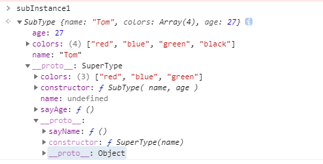
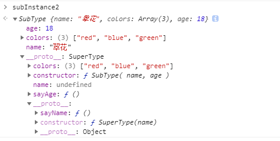

在很多经典的面向对象编程语言中，都支持两种继承方式：接口继承和实现继承。而在JS中，因为函数没有签名，并没有办法实现接口继承（TS替我们做到了这一点），只能支持一种继承方式：`实现继承`的主要工作原理，正是基于上篇文章讲到的[原型链](../原型链/index.md)

在《Javascript高级程序设计》一书中，将继承的实现模式分为6种，即：
0. 原型链继承（参考原型链文章）
1. 经典继承
2. 组合继承
3. 原型式继承
4. 寄生式继承
5. 寄生组合式继承

这几种分类，1和2是一种风格，逐步递进；3和4是另一种风格，最终，将2 和4进行结合得出5，也就是实际编程中使用的`继承`方式。

我一向不太喜欢搞这么多花里胡哨的名词和概念，名词起的太多，会干扰对其本质的探索，对知识点的掌握流于表面。也就是在面试官那里或一些不靠谱的小leader嘴里，这些名词的作用才凸显出来。

# 利用构造函数实现继承 —— 经典继承和组合继承

继承的目的也就是在子类中能够使用父类中的属性和方法，通过构造函数可以很方便的实现这一点。

我们定义两个构造函数，`SuperType()`  和 `SubType()`, 通过在子构造函数中调用父构造函数，可以将父类中所有的属性和方法绑定到子类的实例中，**这也就是经典继承的实现方法**

但同时，我们也知道，对于父类中属性应该在子类中复制一遍，但父类中的方法其实没有必要，我们可以借助原型链的工作原理，让子类和父类共享方法，**这就是组合继承的做法**

```javascript

function SuperType(name) {
  this.name = name
  this.colors = ['red', 'blue', 'green']
}

SuperType.prototype.sayName = function() {
  console.log(this.name)
}

function SubType( name, age ) {
  // 继承父类中的属性
  SuperType.call(this, name)

  this.age = age
}

// 继承方法
const superInstance = new SuperType()
SubType.prototype = superInstance
SubType.prototype.constructor = SubType

SubType.prototype.sayAge = function() {
  console.log(this.age)
}

// 验证
const subInstance1 = new SubType('Tom', 27)
subInstance1.colors.push('black')
console.log(subInstance1.colors)  //  ["red", "blue", "green", "black"]
subInstance1.sayName() // Tom
subInstance1.sayAge() // 27

const subInstance2 = new SubType('翠花', 18) 
console.log(subInstance2.colors) // ["red", "blue", "green"]
subInstance2.sayName() // 翠花
subInstance2.sayAge() // 18

```

继承这个概念是在了解了原型链之后才进行学习的，所以很自然的我们会直接实现这种所谓的组合继承。
将属性在实例中进行私有化，将方法保留在父级的原型对象中，通过重定义子类的原型对象实现方法共享。

 


在控制台中进行查看, 可以看到子类的实例中拥有了父类的属性`colors`, `name`, `sayName`方法则还是存在与父级，子类通过原型链进行查找调用。

# 创建实现继承的方法 —— 原型式继承 和 寄生式继承

这种实现继承的方式对被继承的对象或者说父类的范围进行了扩展，只要你有一个已经存在的对象（不要求这个这个对象一定是由构造函数创建的），将其传入封装好的方法内，在方法内部进行处理之后返回一个新的对象，这个处理后的新对象就实现了对这个传入对象的继承。

那么这个封装的方法做了什么呢？其本质还是对原型链的应用。

在封装的方法内，声明一个构造函数，修改该构造函数的原型对象为传入的对象，然后返回该函数的实例，这就是**原型式继承**

对函数的实例不直接进行返回，而是根据需求对该实例进行扩展之后再返回，这就是**寄生式继承**

```javascript
// 原型式继承
function object(original) {
  function F() {}
  F.prototype = original
  return new F()
} 

// 寄生式继承
function parasitic(original) {
  const clone = object(original)
  clone.sayName = function() {
    console.log(this.name)
  }
  return clone
}

// 验证
const superInstance = {
  name: 'Tom',
  colors: ["red", "blue", "green"]
}
const subInstance1 = parasitic(superInstance)
const subInstance2 = parasitic(superInstance)

subInstance1.colors.push('black')

console.log(subInstance1.colors) // ["red", "blue", "green", "black"]
console.log(subInstance2.colors) // ["red", "blue", "green", "black"]

subInstance1.sayName() // Tom
subInstance2.name = '翠花'
subInstance2.sayName() // 翠花

subInstance1.colors === subInstance2.colors // true
subInstance1.sayName === subInstance2.sayName // false

```
查看`object()`方法可以看出来，将新的构造函数`F`的原型指向传入的对象，并返回其实例，这其实和原型链继承是同样的做法。通过该方法得到的所有实例，都共享`superInstance`对象。

# 寄生组合式继承


