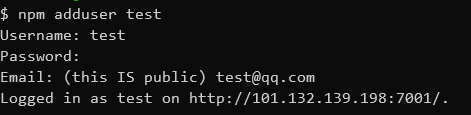
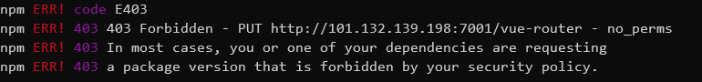
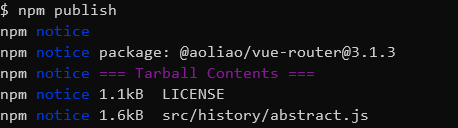
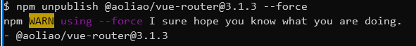
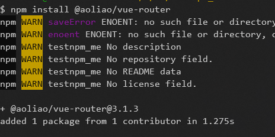
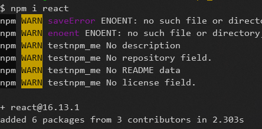
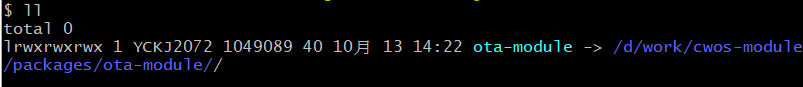
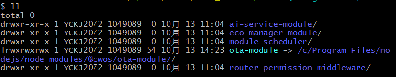
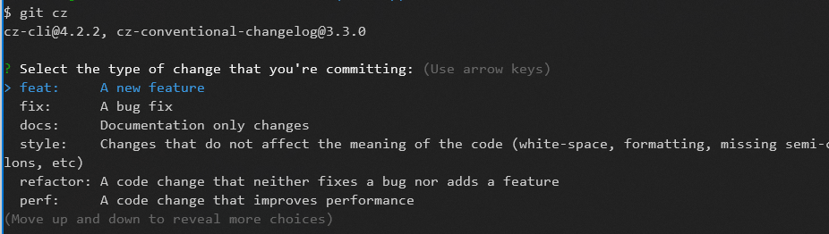
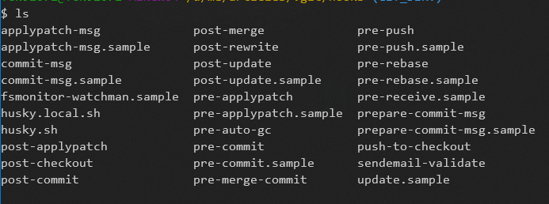

# 大纲
私有化仓库
新建，单测
项目内调试
编译发布
版本管理


# 私有化仓库

搭建私有化仓库是为了对公司的前端中台建设做好支撑，对公司内部的前端组件有更规范的管理，搭建私有化仓库的方法有好多种，国内大厂几乎都使用的`cnpm.org`.

先看一下CNPM是什么：
> cnpmjs.org: Private npm registry and web for Company. 
So cnpm is meaning: Company npm.

cnpm.org是一个NodeJs库，其作用是创建一个企业级的私有化npm仓库，对公司内部npm包提供完整的管理功能，此外还能同步npm的官方仓库( https://registry.npmjs.org/)，CNPM的架构图形象的说明了其功能：


### 环境准备
私有化仓库部署在阿里云ESC，具体涉及到的物料有：
- [ ] centos ：7.6.1810
- [ ] mysql ：5.7.28
- [ ] 安装的**cnpm.org版本** : 2.19.4

这里需要注意一点，许多教程上建议我们直接从github上clone其仓库到服务器，但这可能会导致一个问题，GitHub上最新的版本也许并不稳定，会出现一系列问题。

我最初下载的版本是`cnpm.org 3.0.0-rc.36`, 但是这个版本的数据库语句有问题，导致新增的`token`表创建失败，所以我回滚到了`2.9.4`版本。

`git clone -b 2.19.4 https://github.com/cnpm/cnpmjs.org.git`


### 配置
当代码clone到服务器之后，对`/config/index.js`配置文件做一些必要的修改。

```javascript
 module.exports = { 
    enableCluster: true, // enable cluster mode
    enablePrivate: false, // enable private mode, only admin can publish, other user just can sync package from source npm
    database: {
	    db: 'cnpmjs_test',  // cnpm 数据库的名称
      host: '数据库所在机器的ip',
      port: 3306,
      username: 'aoliao', // 连接数据库时的姓名
      password: 'database pwd '  // 连接数据库时的密码
    },
    admins: {
      admin: 'admin@cnpmjs.org',  // 管理员账号和邮箱
    },
    scopes: [ '@cnpm','@aoliao' ],  // 该仓库允许的scope
    registryHost: "服务器IP:7001或域名", // 私有化仓库的地址
    syncModel: 'none'// 'none', 'all', 'exist'
  };  

```
对几个配置重点说一下：
`enablePrivate`：当值为true时，只允许管理员进行发布，其他任何人没有权限进行发布；当值为false时，任何人都可以发布包，但非管理员发布的包其名称要符合一定的规则，即必须带有允许的scope, 例如：`@aoliao/vuex`，对于管理员用户没有相关要求。

`registryHost`: 配置为仓库所在机器的套接字或直接使用域名。如果不配置，当下载私有化仓库中的私有包时会报404。

`syncModel`: 同步模式。`none`: 不进行同步，只管理用户上传的私有模块，公共模块直接从上游获取；`exist`: 只同步已经存在于数据库的模块；`all`: 定时同步所有源registry的模块


### 建立仓库

到这一步就比较轻松了

1. 根据上文配置，打开mysql服务，新建数据库`cnpmjs_test`
2. 下载cnpm.org所需的依赖包`npm i`
3. 完成之后，运行`npm run start`启动私有化仓库。


在客户端用浏览器访问`http://ip:7002`, 如果能够打开说明安装成功。记得开放服务器对应的端口。在阿里云上则是添加对应的安全组设置。

### 校验

校验时需要将客户端本地的仓库源切换到私有仓库的地址`http://ip:7001`, 这里推荐一个npm源的管理工具`nrm`。

全局安装:`nrm add aoliao http://ip:7001`
切换到私有仓库源：`nrm  use aoliao`

接下来可以进行校验，校验内容包括新增用户，用户登陆，发布，撤销发布，下载私有仓库包，下载公共仓库包等。

##### 新增和登陆
执行`npm adduser`,新增用户，在npm的用户管理逻辑中，新增一个用户，如果成功之后，则自动登陆。如果直接使用`npm login`，使用的是新账号，则自动注册并登陆。成功之后的结果如图所示：



##### 发布 和 取消发布
客户端切换到将要发布的npm包的路径下，以vue-router的源码为例，执行`npm publish`将模块发布到私有仓库。



发布之后发现出现了403错误，查看原因是，此刻我们使用的是非管理员登陆，所以需要对 vue-router 的package.json做个修改，将name添加指定的scope, `@aoliao/vue-router`，再次发布，发布成功。



对于取消发布，系统是比较慎重的，即使是npm的发布者想要取消发布也未必能够成功。当这个包被其他包依赖了，当这个包的发布时间超过了24小时则肯定会取消失败的。这个时候最好使用管理员账号进行操作，执行命令：`npm unpublish @aoliao/vue-router@3.1.3 --force`




##### 下载

发布成功之后，可以即刻从私有仓库进行下载，执行命令：`npm install @aoliao/vue-router`




如果要下载私有仓库不存在的包，则系统会直接从上游进行下载，不会存在找不到下载资源的问题：




# 新建NPM包

新建一个npm包，这件事可简单可复杂。


# 项目内调试

在公司内部开发的模块，尤其是业务模块少不了集成到项目中进行开发调试，我们的需求是模块文件的修改效果可以直接体现在业务项目中。

借助`npm link`可以帮助我们实现这个需求。

```javascript
npm link [<@scope>/]<pkg>[@<version>]
```

1. 首先`cd`进入到模块文件所在的文件夹，执行`npm link` 将模块连接到全局。

2. 然后`cd`进入到项目文件所在的文件夹，执行 `npm link 模块文件名`, 这样模块文件就被安装到项目文件中了，在`node_modules`文件夹中可以查看到该模块文件。

通过命令`npm root -g`可以查询到全局npm存放在`C:\Program Files\nodejs\node_modules`路径下，在该路径中可以查看到所有的全局npm包。`npm link` 指令即是将未发布的模块放到了该路径下。在Windows中查看的话，会发现这个文件夹上有一个箭头，但注意，这里不是一个快捷方式，而是一个软链接。



在项目文件的node_modules中查看目标模块，也可以看到这同样是一个软链接：



通过连续两个软链接，我们在项目的node_models中使用的模块，实际上就是我们本地正在开发的包文件。通过这种方式实现了模块项目更改的效果直接体现在我们的业务项目文件中。

### 模块文件的watch

监听文件变化，实时进行编译（该方式非最优解，有待考证）

 


# 版本管理

### 版本规范标准semver

什么是semver? 这是一个语义化的包管理规范，现在社区发布NPM包都采用这种规范, [官网在这里](https://semver.org/lang/zh-CN/)

规范规定，一个标准的版本号应该是这样的：**主版本号·次版本号·修订号**

- 主版本号(major)：当你做了不兼容的API 修改
- 次版本号(minor)：当你做了向下兼容的功能性新增
- 修订号(patch)：当你做了向下兼容的问题修正

除了标准的版本格式之外，出于某种原因，当系统并非处于一个非常稳定的状态或者说功能非常全面的状态时，需要发布一个先行版本，这个时候需要在标准的版本号上加一点点改动：
- 内部版本（`alpha`）
- 公测版本（`beta`）
- 正式版本的候选版本（`rc`）: rc 即 `release candiate`


我们从一些知名库的版本记录中可以看到这个标准的应用，本地执行
```bash
npm view vue versions
```
可以看到VUE所有的版本记录，懒得截图了，粘贴几个例子看看吧：

`2.6.12`, `3.0.0-alpha.0`, `3.0.0-alpha.1`, `3.0.0-beta.1`, `3.0.0-rc.1`, `3.0.0`, `3.0.1`

##### FAQ

semver做为一个语义化的包版本规范，**版本号的改变具备重要的意义**，但每次版本号的更新还是人为控制的，我们不能说100%不会出问题。当出问题的时候应该怎么办？

**Q**: 如果我们将一个主版本变更当作一个次版本变更发布了该如何处理？

**A**: 即使是这种情况，也不能去修改已发行的版本。重新发行一个新的次版本号来更正这个问题并且恢复向下兼容。可以的话，将有问题的版本号记录到文件中，告诉使用者问题所在，让他们能够意识到这是有问题的版本。

**Q**: 如果即使是最小但不向下兼容的改变都需要产生新的主版本号，岂不是很快就达到 42.0.0 版？

**A**: 这是开发的责任感和前瞻性的问题。不兼容的改变不应该轻易被加入到有许多依赖代码的软件中。升级所付出的代价可能是巨大的。要递增主版本号来发行不兼容的改版，意味着你必须为这些改变所带来的影响深思熟虑，并且评估所涉及的成本及效益比。 


##### 版本发布最佳实践
- 首次对外正式发布版本的时候，版本号定为`1.0.0`
- 对一个包的任何修改都必须以新版本号发行
- 版本号根据代码改动情况，严格按照`major·minor·patch`格式
- 版本号只能递增，不能降级
- 发布重大版本或版本改动较大时，先发布**先行版本**


### Git 提交规范

Git 做为开发过程中一个高频操作，一个纯人工操作，最好也是要遵守一定的规范。践行一个标准的规范可以给我们提供不少的方便：

- 规范的提交记录可以直接从commit 生成Change log(发布时用于说明版本差异)

- 触发构建和部署流程

- 基于提交的类型，自动决定语义化的版本变更。

社区现在最流行的规范是[约定式提交规范Conventional Commits](https://www.conventionalcommits.org/zh-hans/v1.0.0-beta.4/), 其脱胎于`Angular Git 提交 规范`。

##### 规范格式

每次提交的Commit Message格式应该包括三个部分：Header, Body, Footer。格式应该符合下述要求：

```bash
<type>[(scope)]: <subject>
// 空一行
<body>
// 空一行
<footer>
```

Header部分是必须的，Body 和 Footer 可以省略。一般来说，每次提交都只包含 Header 部分。一个高频操作的规范如果过于严格和繁琐，注定不会流行起来。

先简略说一下 Body 和 Footer。

Body 是对本次commit 的详细描述，可以分成多行提交。

Footer 一般情况下可以省略，但是当出现在这两种情况时必须出现，

1）当前提交出现不兼容变动。Footer部分必须以`BREAKING CHANGE`开头，后接具体内容。

2）关闭Issue时。如果当前commit针对仓库中的某个Issue，那么Footer应该是`Close #123, #234`这样的格式。

详细讲一下 Header。

Header部分只有一行，包括三个部分：`type`（必须）, `(scope)`（可选）, `subject`（必须）。

- type 用于说明本次commit的类别。它的值应该在一个枚举中选择
- scope 用于说明本次commit的影响范围，只要是能让本项目的人员理解就可以
- subject 是commit目的的简短描述

types值的类型随着规范的发展可能会有修改，截至到笔者写作时，Conventional 规定的[完整的规范有这些](./assets/commit-type.json) 。

 当然，如果项目需要，我们也可以自定义一套我们自己的提交规范，就像 Conventional 一样， 在这套规范中，除了`feat` 和 `fix` ，我们可以定义自己需要的type。

type 枚举值常用的有：
1. feat： 新功能
2. fix: bug修复
3. docs: 文档或注释的变动
4. style: 代码编码格式的变动，不是css的变动
5. refactor: 重构
6. test： 测试文件的改动
7. chore: 构建过程或辅助工具的变动 


##### Git规范和SemVer的关系

git约定的这个规范和 SemVer 有什么关联呢？关系就是我们可以借助每次git提交的规范自动维护语义化版本号。

fix 类型提交应当对应到 `PATCH` 版本。feat 类型提交应该对应到 `MINOR` 版本。带有 BREAKING CHANGE 的提交不管类型如何，都应该对应到 `MAJOR` 版本。


在项目开发过程中，经常会有这样的疑惑，**如果提交符合多种类型我该如何操作？** 官方给出的回答是：回退并尽可能创建多次提交。约定式提交的好处之一是能够促使我们做出更有组织的提交和 PR。

如果我不小心使用了错误的提交类型，该怎么办呢？当你使用了在规范中但错误的类型时，例如将 feat 写成了 fix
在合并或发布这个错误之前，我们建议使用 git rebase -i 来编辑提交历史。而在发布之后，根据你使用的工具和流程不同，会有不同的清理方案。参考上一节对错误版本号的处理。

##### Git规范约束工具之 commitizen

[commitizen](https://github.com/commitizen/cz-cli)是一个提交日志工具，辅助开发者使用提交规则。它本身是支持多种不同的提交规范的，只需要安装和配置不同的适配器。

本文自然以 Conventional 为例，讲解一下具体如何使用。

```bash
// 首先全局安装 commitizen
npm install commitizen -g

// 在项目中配置 Conventional 规范
commitizen init cz-conventional-changelog --save-dev --save-exact
```
配置完成之后，以后每次提交可以使用`git cz` 代替`git commit`。 `git cz` 会有一个交互式界面辅助进行符合规范的提交。




##### Git规范约束工具之 CommitLint

每次使用交互界面提交效率其实并不高，所以社区给出了另一种方案[commitlint](https://github.com/conventional-changelog/commitlint)， 看名字也能看出来是一种Lint检查。它通过校验每次提交的内容是否符合格式来判断是否放行本次提交。

```bash
// 本地安装命令行工具
npm install @commitlint/cli -D

// 本地安装Conventional配置
npm install @commitlint/config-conventional -D

```

commitlint做为一个命令行工具，具体的配置可以查看[这里](https://commitlint.js.org/#/reference-cli)


除了 Conventional 规范，还有下列提交规范可以选，这些规范分别使用于不同的场景：
@commitlint/config-angular
@commitlint/config-lerna-scopes
@commitlint/config-patternplate
conventional-changelog-lint-config-atom
conventional-changelog-lint-config-canonical
commitlint-config-jira

安装对应的npm之后，在项目根目录下新建`commitlint.config.js`文件，文件内容：
```javascript
module.exports = {extends: ['@commitlint/config-conventional']};
```
或者在根目录下的`package.json`文件内，新建字段：
```json
{
  "commitlint": {
    "extends": [
      "@commitlint/config-conventional"
    ]
  }
}
```

安装完commitlint之后，还需要一个工具：[husky](https://docs.breword.com/typicode-husky)

```bash
npm install husky -D

```
安装husky之后会在项目的`.git/hooks`目录下生成所有的hook脚本。


在`package.json`中配置对应的钩子之后，项目在执行git操作之时会触发对应钩子的脚本

```json
{
  "husky": {
    "hooks": {
        "commit-msg": "commitlint -E HUSKY_GIT_PARAMS"
    } 
  }
}

```
`HUSKY_GIT_PARAMS` 是husky定义的环境变量。它指向路径`.git/COMMIT_EDITMSG` 代表最后一次提交时输入的信息。

### 版本管理工具lerna

参考文章：
[手摸手教你玩转 Lerna](http://blog.runningcoder.me/2018/08/17/learning-lerna/)
[lerna 中文文档](https://github.com/minhuaF/blog/issues/2)

什么是lerna ?

> Lerna is a tool that optimizes the workflow around managing multi-package
repositories with git and npm.

[lerna](https://github.com/lerna/lerna) 是一种工具，用于优化使用git和npm管理多包存储库的工作流程。

##### Monorepo VS Multirepo

Monorepo 指单体式仓库，是指把所有可以发布的包都放到一个项目中进行管理，例如Babel。

Multirepo 指多体式仓库，是指每一个可以发布的包都是一个单独的项目，例如webpack。

二者的优缺点都比较明显。在公司的一个部门内，基于业务关系而划分的各种模块一般比较使用使用 Monorepo 


##### lerna 的使用场景

##### lerna 可以做什么


##### lerna 如何使用

lerna的重心是用于多包管理。


