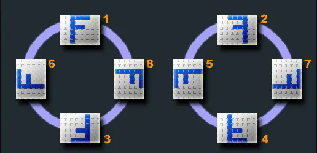

support群里报了一个幽灵bug，标注人对图片进行严丝合缝的标注之后，复核人对其进行复核的时候确发现其谬之千里。没有代码错误，也很难复现，第一反应是代码逻辑出了问题，细研究之后发现和浏览器版本有关。

Chrome浏览器长久以来，准确的说是在 **81** 版本之前，对``标签展示的图片是有问题的。

我们用手机，数码相机等设备拍摄的图片是具有`元数据exif`的，而且这个exif包含的数据还相当丰富，包括拍摄时的角度，位置信息，设备型号等等。具体的信息可以看[这里](https://www.sojson.com/image/exif.html)

我们此次说的Chrome浏览器的问题就和exif中的**Orientation** 有关。这个值表示当时设备拍摄时的手持角度。一共有8个值。正常的图片浏览器会根据Orientation值展示图片，包括在Chrome的独立标签中也是这样展示的。



但是在**81**版本之前，`` 标签 和 `canvas`加载的图片，只会按照`Orientation = 1`的方式进行展示，在**81**版本之后才修复了这个问题。

但正因为这样，我们项目出现了一个问题，对于一个 `Orientation !== 1`的图片，在老版本进行标注之后，如果再次用新版本打开进行标注，上次标注的结果和图片上的位置就对应不上了。我们可以看做是新版本的浏览器对图片进行了一次默认的旋转。

为了解决这个问题，我们以新版本的浏览器展示效果为准，对老版本的浏览器进行一次兼容操作。

初始的想法很简单，想在`canvas`上对图片进行旋转操作，但仔细想想这不可行，因为旋转之后的图片会影响后续标注结果的准确性。所以采取的做法是在加载图片的时候进行判断，如果在老版本浏览器加载图片，那么根据Orientation的值生成一个新的图片供标注使用。

社区有一个不错的仓库可以使用，[点击这里](https://github.com/blueimp/JavaScript-Load-Image#orientation)

```javascript
const loadImage = require('blueimp-load-image')

private async getImage(): Promise<HTMLImageElement> { 
  try {
    const version:number = this.getChromeVersion() // 获取浏览器版本
    if (version >= CHORMEVERSION) {
      const img = await this.getOriginImage() // 新版本不做处理
      return img
    } else {
      // 根据orientation生成新的图片
      const data = await loadImage(this.url, {
        orientation: true 
      }) 
      return data.image 
    }      
  } catch (error) {
    return error
  }    
}

```

如何根据Orientation生成新的图片呢，自然要借助canvas，首先将图片渲染到canvas中，然后根据Orientation的值对canvas中的图片进行变形操作，最后借助`toDataURL`生成新的图片。

```javascript
function resetOrientation(srcBase64, srcOrientation, callback) {
  var img = new Image();    

  img.onload = function() {
    var width = img.width,
        height = img.height,
        canvas = document.createElement('canvas'),
        ctx = canvas.getContext("2d");

    // set proper canvas dimensions before transform & export
    if (4 < srcOrientation && srcOrientation < 9) {
      canvas.width = height;
      canvas.height = width;
    } else {
      canvas.width = width;
      canvas.height = height;
    }

    // transform context before drawing image
    switch (srcOrientation) {
      case 2: ctx.transform(-1, 0, 0, 1, width, 0); break;
      case 3: ctx.transform(-1, 0, 0, -1, width, height); break;
      case 4: ctx.transform(1, 0, 0, -1, 0, height); break;
      case 5: ctx.transform(0, 1, 1, 0, 0, 0); break;
      case 6: ctx.transform(0, 1, -1, 0, height, 0); break;
      case 7: ctx.transform(0, -1, -1, 0, height, width); break;
      case 8: ctx.transform(0, -1, 1, 0, 0, width); break;
      default: break;
    }

    // draw image
    ctx.drawImage(img, 0, 0);

    // export base64
    callback(canvas.toDataURL());
  };

  img.src = srcBase64;
};


```


